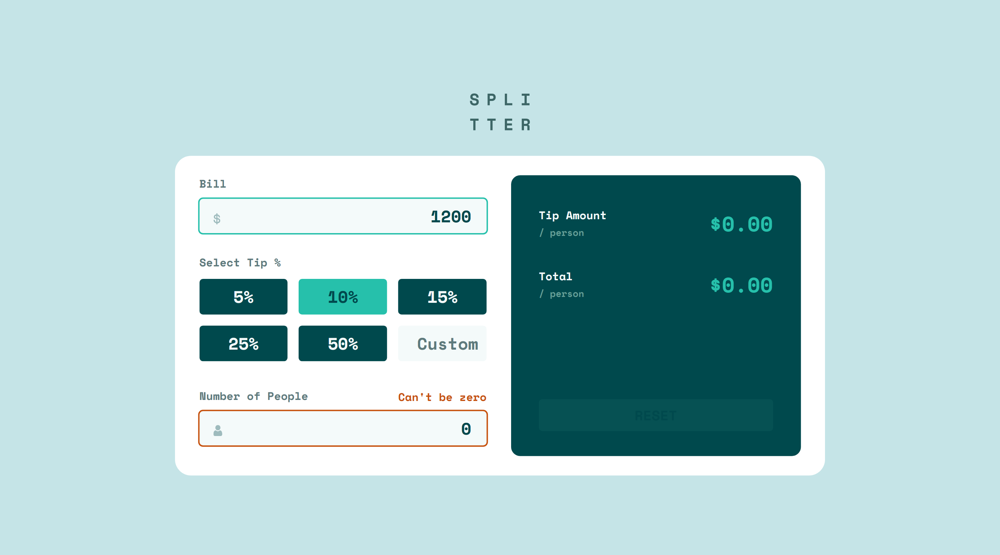
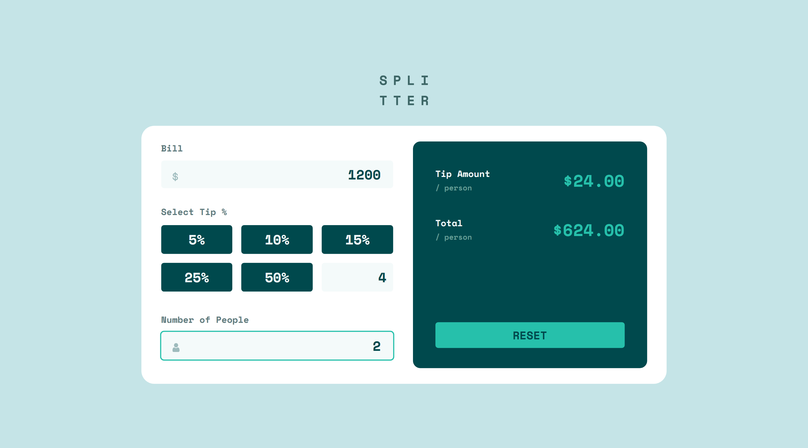

# Tip calculator app


### Overview


Users should be able to:

- View the optimal layout for the app depending on their device's screen size
- See hover states for all interactive elements on the page
- Calculate the correct tip and total cost of the bill per person

### Screenshot

**Snapshot at desktop width 1440px > Person Zero**



**Snapshot at desktop width 1440px > With Input**




## My process

### Built with

- Semantic HTML5 markup
- CSS custom properties
- Flexbox
- CSS Grid
- Mobile-first workflow

### What I learned

To remove up-down arrow button from input.

For **Chrome, Safari, Edge, Opera**

```css
.tip .custom::-webkit-outer-spin-button,
.tip .custom::-webkit-inner-spin-button {
  -webkit-appearance: none;
  margin: 0;
}
```

For **Firefox**

```css
.tip .custom[type='number'] {
  -moz-appearance: textfield;
  appearance: textfield;
}
```

### Useful resources

- [Google API](https://fonts.googleapis.com/css2?family=Space+Mono:wght@700&display=swap) - For font _Space Mono_

- [w3schools](https://w3schools.com) - To remove increment and decrement arrow in input

## Author

Meenu Soni 👨‍💻

- GitHub - [@MeenuSoni](https://github.com/m01-s01)

